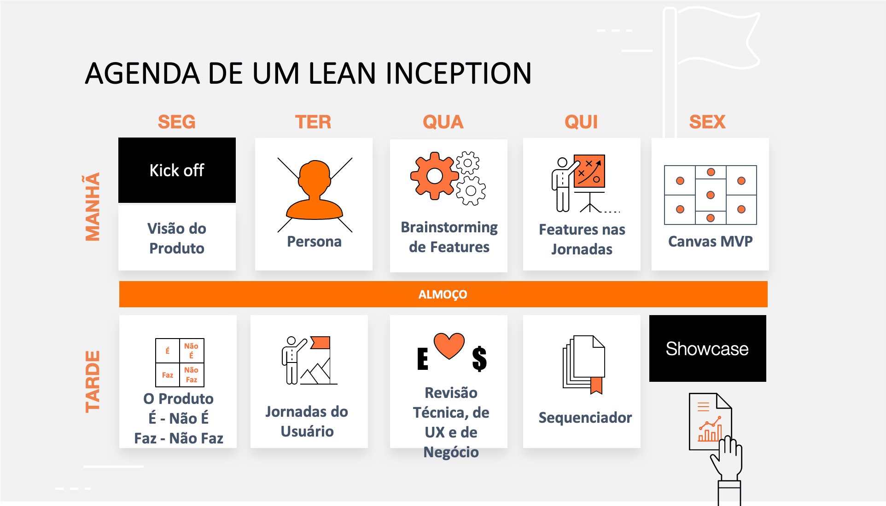

### Histórico da Revisão
| Data | Versão | Descrição | Autor |
|---|---|---|---|
| 17/03/2021| 0.1 |Criação do documento | Ana Carolina Carvalho |

## Agenda da Lean Inception

Na aplicação da Lean Inception, o autor sugere duas agendas diferentes, mas com as mesmas dinâmicas. Cada agenda tem um foco principal diferente, por mais que o resultado final seja semelhante.

### A agenda escolhida

Nesta agenda, o ‘Brainstorming de funcionalidades’ acontece logo após a atividade ‘Jornadas do usuário’. Recomendada essa sequência se desejamos que a criação / ideação de funcionalidades seja muito influenciada pelas ‘Jornadas do usuário’.

Fonte: https://www.caroli.org/template-de-agenda-da-inception-enxuta/

## Kick-off

A sessão de kick-off serve para orientar os participantes com as razões do negócio, e dar início ao entendimento comum das suas principais necessidades e objetivos. Como a dinâmica deve seguir, qual o objetivo dessa metodologia, apresentar os participantes, contextualizar o problema.
É tirada as dúvidas que possam surgir antes mesmo de colocar em prática. Além de alinhar as expectativas do time. 