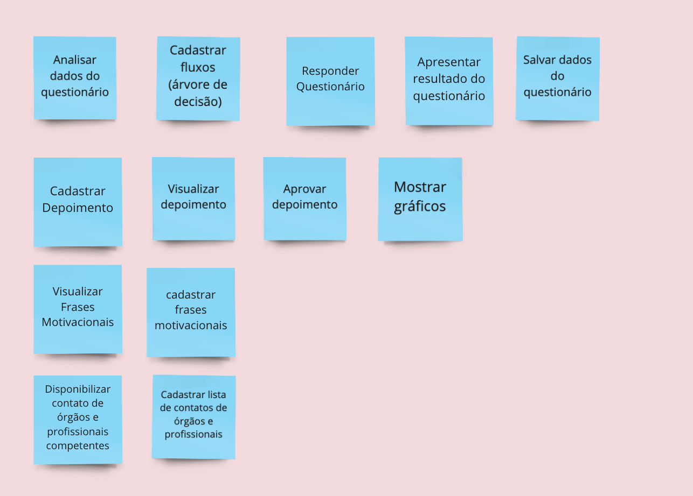

### Histórico da Revisão
| Data | Versão | Descrição | Autor |
|---|---|---|---|
| 17/03/2021| 0.1 |Criação do documento | Ana Carolina Carvalho |

## Brainstorming de features

Feature é a descrição de uma ação ou interação de um usuário com o produto. Por exemplo: imprimir nota fiscal, consultar extrato detalhado, e convidar amigos do facebook. A descrição de uma funcionalidade deve ser o mais simples possível. O usuário está tentando fazer uma coisa. O produto deve ter uma funcionalidade para isso. Que feature é essa?

Feature é um agrupamento de funcionalidades afins. Tal agrupamento ajuda a compreender o produto como um todo, bem como as suas partes menores e complementares. O entendimento de feature varia de time para time, o que é importante é que ele faça sentido para aquela equipe.

Como o time deseja que as features sejam influenciadas pela jornada do nosso usuário, está dinâmica ficou após a supra citada. Esta decisão também foi citada no documento da agenda do projeto. 

### Resultado da dinâmico no Miro

Fizemos um momento para o brainstorming, todos os integrantes deveriam escrever features que acreditavam fazer parte do sistema. 
Após o time box, analisamos tudo que foi escrito e associamos à jornada do nosso usuário, assim filtramos as features que não se encaixavam no escopo do MVP. 

Fonte: https://www.caroli.org/atividade-descobrindo-as-features/