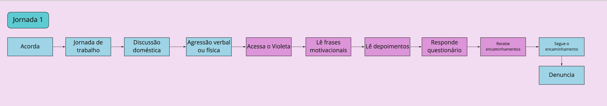
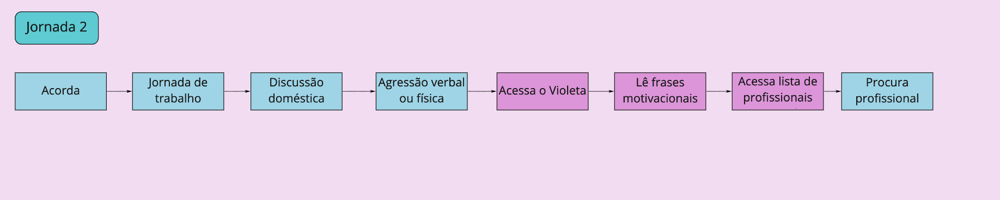
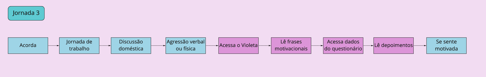

### Histórico da Revisão
| Data | Versão | Descrição | Autor |
|---|---|---|---|
| 17/03/2021| 0.1 |Criação do documento | Ana Carolina Carvalho |

## Jornada do usuário

A jornada do usuário descreve o percurso de um usuário por uma sequência de passos dados para alcançar um objetivo. Alguns desses passos representam diferentes pontos de contato com o produto, caracterizando a interação do usuário com ele.
Neste momento retornamos à perspectiva das personas. Agora focando nas suas jornadas, o passo a passo realizado para alcançar um objetivo.

Na dinâmica de personas identificamos que não teremos diversos tipos de usuário com diferentes permissões. Desta forma, trabalhamos com a mesma perspectiva.

Durante a dinâmica, identificamos 3 possíveis jornadas do nosso usuário usando as principais funcionalidades do sistema. Como pode ser observado nas imagens a seguir:

