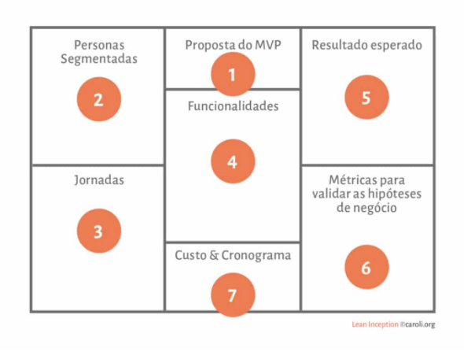
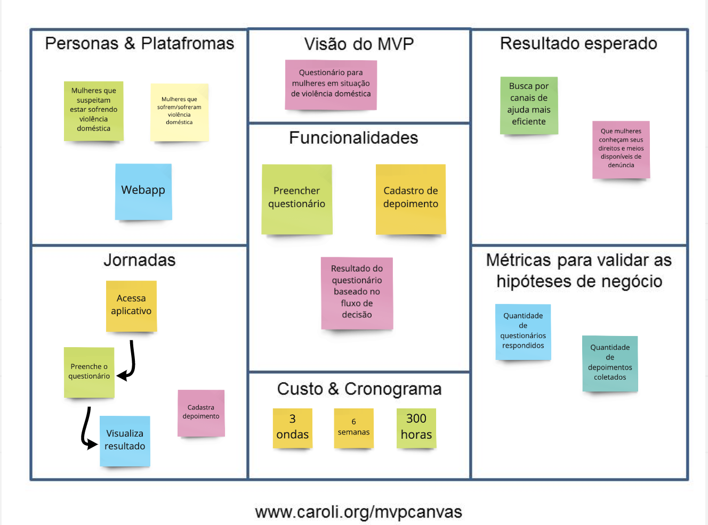

### Histórico da Revisão
| Data | Versão | Descrição | Autor |
|---|---|---|---|
| 17/03/2021| 0.1 |Criação do documento | Ana Carolina Carvalho |

## MVP Canvas

O Canvas MVP é uma ferramenta para validar ideias de produtos. É um quadro visual que auxilia empreendedores a alinhar e definir a estratégia do MVP–Minimum Viable Product, em inglês, a versão mais simples de um produto que pode ser disponibilizada para o negócio (produto mínimo) e que possa ser efetivamente utilizado e validado pelo usuário final (produto viável). Ele é baseado nas perspectivas de Design Thinking e Lean Startup.

É a última fase do workshop. E mesmo assim pode ser usada de maneira independente. É como se fosse o resumo de todas as dinâmicas.

Segue a ordem recomendada para preencher e pensar sobre os blocos:

<b>Proposta do MVP</b> – Qual é a proposta deste MVP?
<b>Personas segmentadas</b> – Para quem é esse MVP? Podemos segmentar e testar este MVP em um grupo menor?
<b>Jornadas</b> – Quais jornadas são atendidas ou melhoradas com este MVP?
<b>Funcionalidades</b> – O que vamos construir neste MVP? Que ações serão simplificadas ou melhoradas neste MVP?
<b>Resultado esperado</b> – Que aprendizado ou resultado estamos buscando neste MVP?
<b>Métricas para validar as hipóteses do negócio </b>– Como podemos medir os resultados deste MVP?
<b>Custo & Cronograma </b>– Qual é o custo e a data prevista para a entrega deste MVP? Depois de entregue, quanto tempo precisamos coletar os dados para decidir se pivotamos ou prosseguimos?

### Resultado da dinâmica feita pelo time

O MVP Canvas foi totalmente produzida por MDS a fim de verificar se eles entenderam o que seria o projeto e o que eles terão que fazer.

Fonte: https://www.caroli.org/o-canvas-mvp/