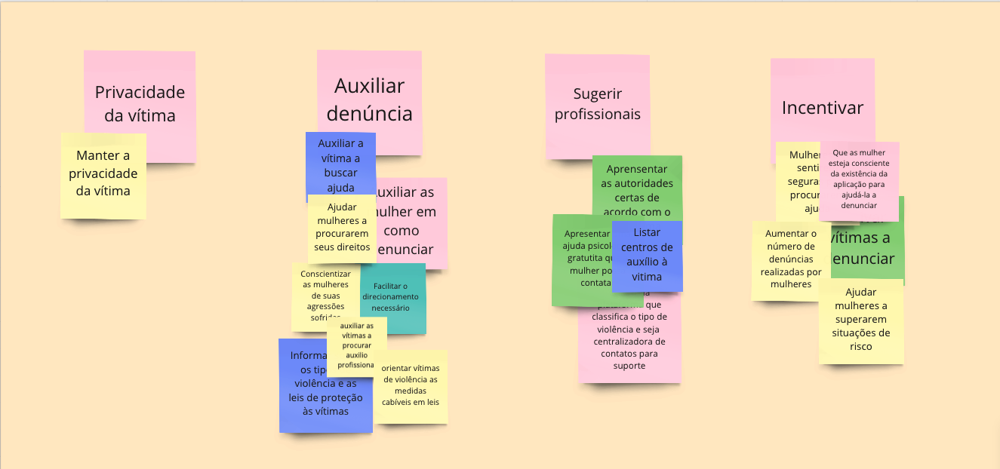
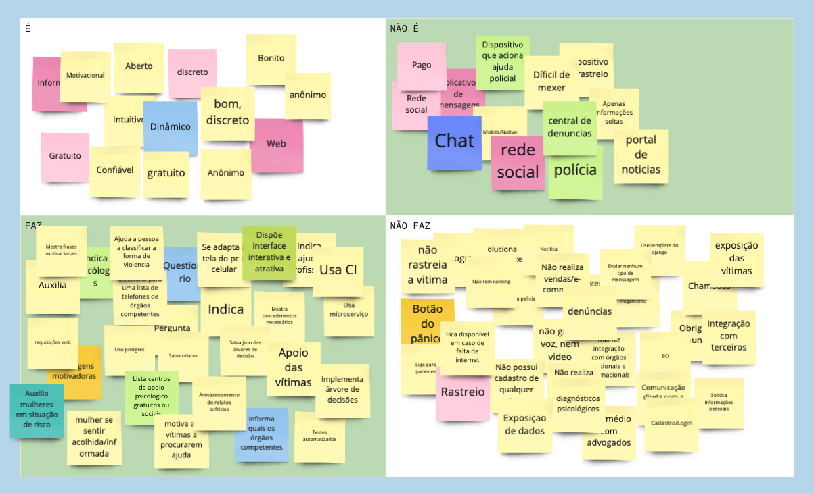

### Histórico da Revisão
| Data | Versão | Descrição | Autor |
|---|---|---|---|
| 17/03/2021| 0.1 |Criação do documento | Ana Carolina Carvalho |

## Documento do Objetivo do projeto

Cada membro da equipe deve compartilhar o que entende sobre os objetivos do produto e isto deve ser discutido para que o time alcance um consenso sobre o que é realmente importante.

O resultado da dinâmica de identificar junto ao time o Objetivo do produto que será desenvolvido foi o seguinte:

1. Privacidade da vítima;
2. Auxiliar denúncia;
3. Sugerir profissionais;
4. Incentivar.

### Quadro da dinâmica no Miro

## Dinâmica "é - não é / faz - não faz"

A atividade É - Não É / Faz - Não Faz ajuda a definir um tópico (seja um produto, um time, ou uma estratégia). Por vezes é mais fácil descrever algo pelo que tal coisa não é ou deixa de fazer. Essa atividade busca clarificações desta forma, indagando especificamente cada aspecto positivo e negativo sobre ser ou fazer algo.

Dica: Para descrever o produto como substantivo ou adjetivo, coloque o post-it no "É"; mas se for um verbo indicando ação, coloca no "Faz". Exemplo: "Seguro" e "Aplicativo mobile" vão para o quadrante "É". "Reserva alguma coisa" e "Conecta alguém" no quadrante "Faz".

Ao final, cada membro deve compartilhar o que entende como objetivo para o negócio. Os vários pontos de vista devem ser discutidos para chegar a um consenso.

**Passo a passo da atividade:**

1. Divida um quadro branco ou flipchart em quatro áreas ( É / Não é / Faz / Não faz);
2. Escreva o tópico em destaque, acima dos quadrantes;
3. Solicite que cada participante descreva o tópico, descrevendo-o em post-its e colocando-os nas áreas devida;
4. Leia e agrupe as notas afins.

Fonte: https://www.caroli.org/o-produto-e-nao-e-faz-nao-faz/

### Quadro da dinâmica no Miro

Durante a dinâmica foram criados dois quadros, um para o time de EPS e outro pra MDS, a fim de que ninguém se sentisse desconfortável ou que alguém não participasse. Após o time box para preenchimento dos post-its, unimos todos os cards no mesmo quadro e o resultado é esse acima.