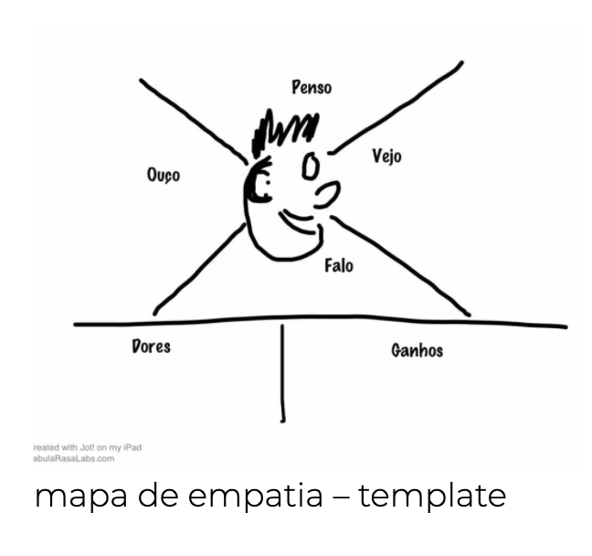
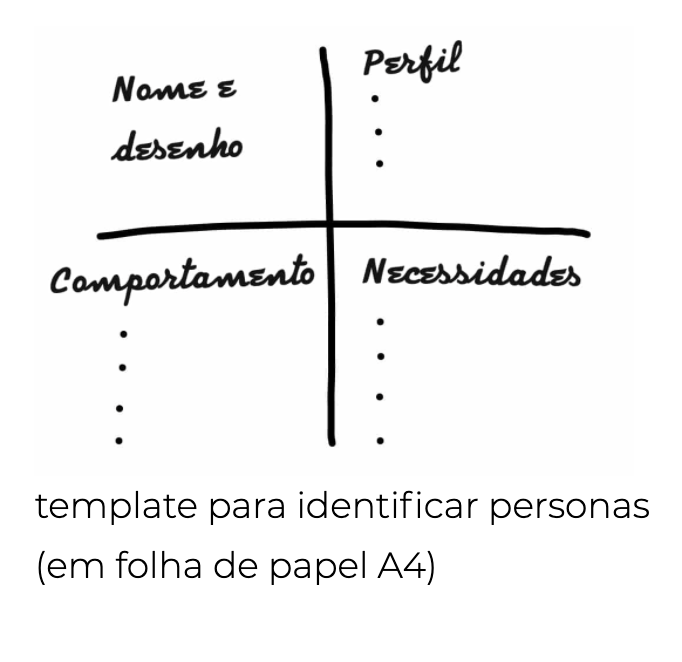
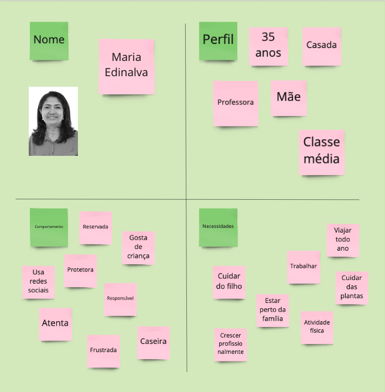
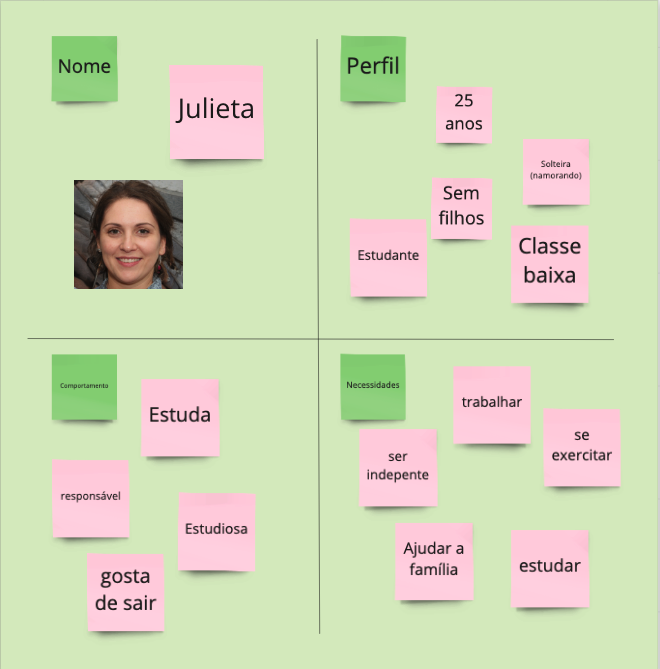
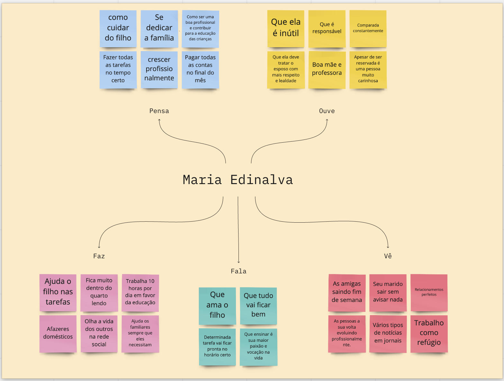

### Histórico da Revisão
| Data | Versão | Descrição | Autor |
|---|---|---|---|
| 17/03/2021| 0.1 |Criação do documento | Ana Carolina Carvalho |

## Personas e Mapa de empatia

Para efetivamente identificar as funcionalidades de um sistema, consideramos importante ter em mente os usuários e seus objetivos. A maneira que normalmente utilizamos para representar estes usuários é através de personas.

O Mapa de Empatia é um template visual para identificação e visualização de uma persona. Criado originalmente para análise de segmentos de consumidores [1], o Mapa de Empatia de é uma excelente ferramenta para classificar, explorar e entender os diferentes tipos de personas.
O Mapa de Empatia foi originalmente descrito por Dave Gray como um dos métodos da XPLANE [1] para compreender usuários, clientes e outros envolvidos no negócio. Ficou ainda mais conhecido desde que foi destacado no livro Business Model Generation como uma ferramenta para descobrir insights sobre os clientes [2].

Para efetivamente identificar as funcionalidades de um sistema, é importante ter em mente os usuários e seus objetivos. A maneira normalmente utilizada para representar estes usuários é através de personas.
Uma persona representa um usuário do sistema, descrevendo não só o seu papel, mas também suas necessidades específicas. Isto cria uma representação realística de usuários, auxiliando o time a descrever funcionalidades do ponto de vista de quem interagirá com o produto final.

### Quadrante para identificar tipos de personas

Utilizada para descrever os tipos de personas.

As pessoas que conhecem os objetivos do negócio e as necessidades dos usuários devem participar ativamente do exercício, auxiliando a equipe na criação das personas e sugerindo alterações em suas descrições, conforme necessário.

### Quadro da dinâmica no Miro

### Criando mapas de empatia

Nessa dinâmica procuramos entender o nosso usuário. Suas dores, ganhos, o que ela vê, ouve, fala e pensa. De acordo com o contexto. Deve ser preenchido pelo mesmo time da dinâmica anterior. 

**Passo a passo da atividade:**

1. Decida uma persona a ser analisada
2. Desenhe um template do mapa, com a persona representada no centro do template
3. Descreva as áreas para tal persona

### Quadro da dinâmica no Miro

Referências:
https://www.caroli.org/criando-mapas-de-empatia/
https://www.caroli.org/atividade-identificando-personas/
[1] XPLANE, uma empresa de Visual thinking, fundada em 1993 por Dave Gray. http://xplane.com/
[2] Osterwalder, A., Pigneur, Y., Business Model Generation, A Handbook for Visionaries, Game Changers, and Challengers (Amsterdam: OSF, 2009)