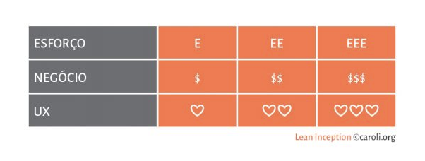
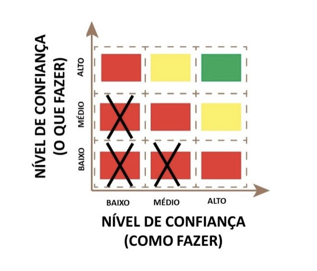
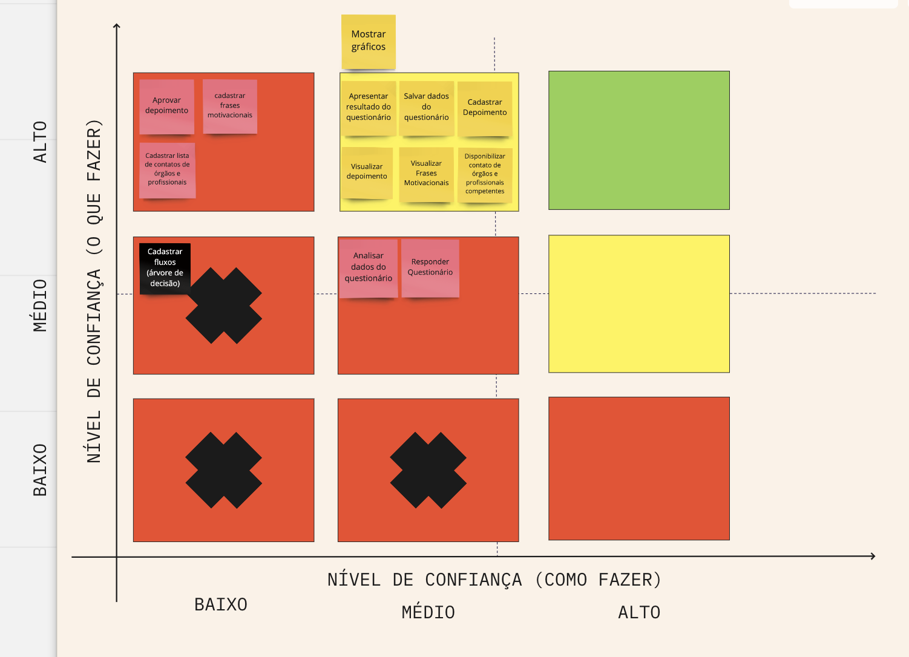
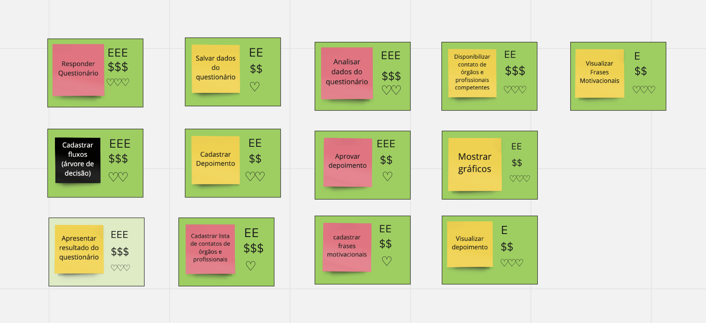

### Histórico da Revisão
| Data | Versão | Descrição | Autor |
|---|---|---|---|
| 17/03/2021| 0.1 |Criação do documento | Ana Carolina Carvalho |

## Revisão Técnica, de UX e de Negócio 

Vamos alinhar como a equipe se sente em relação ao entendimento técnico e o entendimento de negócio para cada feature, bem como o esforço e o valor de negócio associado a mesma.

As funcionalidades foram listadas, entretanto foram aceitas sem ressalvas, sem perder muito tempo entendendo as mesmas em detalhes, fazendo anotações e conversando sobre incertezas, esforço, valor de UX e valor para o negócio.
Entretanto essas conversas e informações mais detalhadas são muito úteis para uma melhor compreensão e planejamento de criação de produtos enxutos. A Revisão Técnica, de Negócio e de UX através do Gráfico do Semáforo e da Tabela Esforço, Negócio e UX busca tal informação de forma rápida e eficiente.

Para esforço, valor de negócio e valor de UX (User experience), avaliamos e classificamos as funcionalidades com alguns símbolos.

Neste ponto, é muito levado em consideração a opinião do PO, UX/UI e de time de desenvolvimento. E deve haver um consenso entre eles.

Já classificar o nível de confiança do time em desenvolver o que foi proposto é um pouco mais complicado. Para isso é usado o gráfico do semáfaro. Nele classificamos as funcionalidades combinando o nível de confiança de como a tarefa deve ser feita e o nível de confiança do time em o que deve ser feito.

Ao terminar a revisão técnica, de negócio e de UX, todas as funcionalidades estarão mapeadas. 

### Como classificar

#### Gráfico do semáforo

1. Escreva cada item de trabalho em um post-it
2. Identifique o nível de confiança: O QUE versus COMO
3. Converse sobre valor e esforço relativo
4. Coloque em ordem

Faça as seguintes perguntas para cada item de trabalho:

* Eixo X: Quão confiante você está sobre COMO fazer esse item?
* Eixo Y: Quão confiante você está sobre O QUE quer desse item?

No eixo X: Você já fez isso antes? Você sabe como fazê-lo? A resposta “sim” indica alto nível de confiança sobre COMO fazer. “Mais ou menos”, “talvez” ou “acho que sim” indica nível médio; enquanto que “não” indica nível baixo.

No eixo Y: Você sabe definir o resultado deste item? Você sabe O QUE quer desse item? A resposta “sim” indica um alto nível de confiança sobre O QUE fazer; “mais ou menos”, “talvez” ou “acho que sim” indica nível médio; enquanto que “não” indica nível baixo.

Cole cada post-it em um cartão de índice, os quais são verde, amarelo ou vermelho, identificando respectivamente níveis de confiança alto, médio ou baixo, conforme demonstrado no gráfico O QUE versus COMO.
O cartão vermelho com um X identifica um item com nível de confiança baixíssimo. Evite-o a todo custo. Tente esclarecê-lo antes de começar a trabalhar, ou seja, somente leve adiante itens colados em cartões verde, amarelo ou vermelho.

### Resultado da dinâmica feita pelo time

Note que apenas uma atividade foi classificada como crítica, e nenhuma tarefa foi classificada no quadrinho verde. Isso é muito bem explicado com a falta de experiência do time de desenvolvimento, mesmo com a ajuda do time de EPS. Já que serão eles que irão desenvolver.

### Revisão técnica, negócio e UX

Logo após os cards devem receber marcações segundo a tabela de esforço, negócio e UX já apresentada no início deste documento. 
Explicando um pouco melhor, no gráfico a funcionalidade recebe uma cor; já na tabela os cards recebem marcações. 
A cor e a marcação vão ajudar o time nas atividades subsequentes para priorizar, estimar e planejar.

### Resultado da dinâmica feita pelo time

Com a ajuda de todos os membros do time, classificamos dessa forma as features levantadas até o momento.