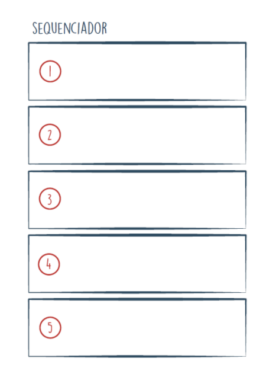
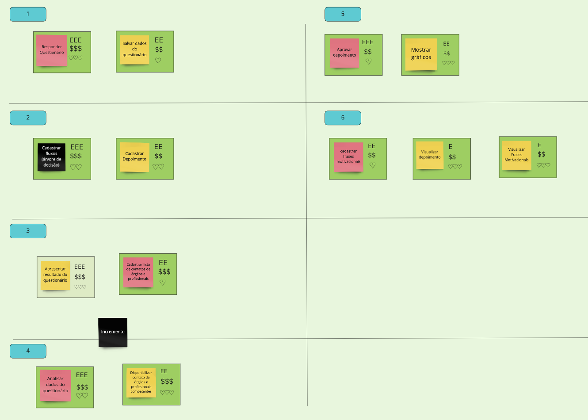

### Histórico da Revisão
| Data | Versão | Descrição | Autor |
|---|---|---|---|
| 17/03/2021| 0.1 |Criação do documento | Ana Carolina Carvalho |

## Sequenciador

O sequenciador é uma ferramenta visual, de fácil entendimento e bastante eficaz para que as pessoas compreendam, organizem e priorizem melhor os seus itens de trabalho.
Neste momento da Lean Inception é feita a ordem mais adequada para criar as funcionalidades listas, definir, de fato, o MVP e seus incrementos. 
Considerando o que significa um MVP, mapeamos a ordem que o projeto deve caminhar. 

Passo a passo do sequenciador:

1. Escreva cada item de trabalho em um post-it
2. Identifique o nível de confiança: O QUE versus COMO
3. Converse sobre valor e esforço relativo
4. Coloque em ordem

#### As regras do sequenciador

Para ajudar a decidir o que entra em cada onda e normalizar o tamanho delas, segue a lista de regras que devem ser seguidas.

<b>Regra 1:</b> Uma onda pode conter, no máximo, três cartões.
<b>Regra 2:</b> Uma onda não pode conter mais de um cartão vermelho.
<b>Regra 3:</b> Uma onda não pode conter três cartões amarelos e vermelhos.
<b>Regra 4:</b> A soma de esforço dos cartões não pode ultrapassar cinco Es.
<b>Regra 5:</b> A soma de valor dos cartões de uma onda não pode ser menos de quatro $s e quatro corações.
<b>Regra 6:</b> Se um cartão depende de outro cartão, esse outro deve estar em alguma onda anterior.

Essas são as seis regras para adicionar cartões às ondas. Tais regras foram definidas depois de aplicar esta forma de organização e priorização de itens de trabalho inúmeras vezes.
O intuito é executar o que é mais importante o quanto antes, nas primeiras ondas.
No projeto Violeta, definimos que cada onda seria uma sprint nossa. A partir disso, toda vez que aplicávamos as regras do sequenciador pensávamos também na questão do tempo.

### Resultado da dinâmica feita pelo time

É interessante notar que todos estão muito bem alinhados em relação às principais jornadas e suas funcionalidades. Perceba que nessa fase também já identificamos o que seria nosso MVP e o seu incremento.
Incremento é o que adicionamos depois que o MVP fica usável. Não adicionamos um MVP em outro, adicionamos incrementos.

Fonte: https://www.caroli.org/sequenciador/