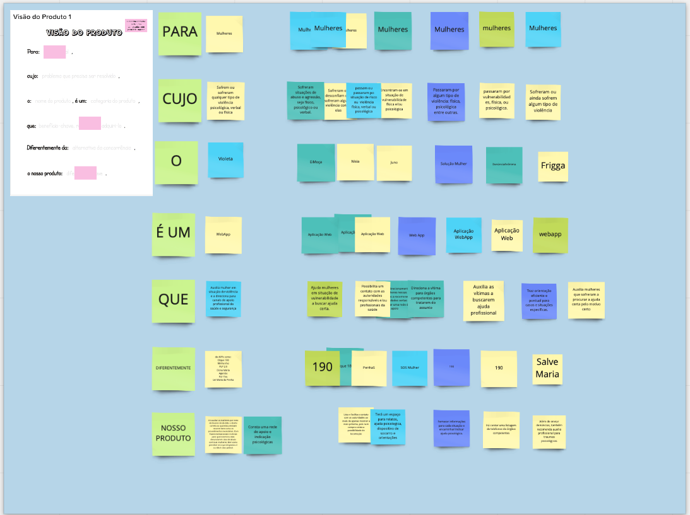

### Histórico da Revisão
| Data | Versão | Descrição | Autor |
|---|---|---|---|
| 17/03/2021| 0.1 |Criação do documento | Ana Carolina Carvalho |

## Documento da visão do produto 

Neste ponto o entendimento da necessidade do produto guiará as atividades seguintes. Os conceitos apresentados inicialmente são apenas uma visão, e a ideia será refinada durante a inception.
Sendo assim, o refinamento ocorre no decorrer das dinâmicas.

O template é:

<b>Para</b> [Cliente final]  
<b>Cujo</b> [problema que precisa ser resolvido], 
<b>O</b> [nome do produto] 
<b>É um</b> [Categoria do produto] 
<b>Que</b> [benefício chave, razão para adquiri-lo]. 
<b>Diferentemente de </b>[alternativa da concorrência], 
<b>O nosso produto</b> [diferença chave]. 

Fonte: https://www.caroli.org/visao-do-produto-exemplos-de-resultados/

### Resultado da dinâmica
<b>Para</b> mulheres,  
<b>Cujo</b> Sofrem ou sofreram qualquer tipo de violência psicológica, verbal ou física, 
<b>O</b> Violeta 
<b>É um</b> WebApp 
<b>Que</b> Auxilia mulher em situação de violência e a direciona para canais de apoio profissional de saúde e segurança, 
<b>Diferentemente de</b> APPs como: 
Clique 180, 
Minha Voz, 
PLP 2.0, 
Dona Maria, 
Agentto, 
For You, 
Lei Maria da Penha, 
<b>O nosso produto</b> irá auxiliar as mulheres por meio de árvores de decisão o direito correto ao qual elas precisam recorrer bem como os procedimentos necessários. Com frases motivacionais e noticias para que incentive a elas denunciarem caso de abuso contra as mulheres. Bem como perceber se o que ela passou é ou não é caso judicial. Além de uma rede de apoio com indicações de profissionais.

### Quadro no Miro:

O resultado dessa dinâmica substitui o documento de visão tradicional. Isso foi alinhado com o Professor Hilmer no dia 26/02.

