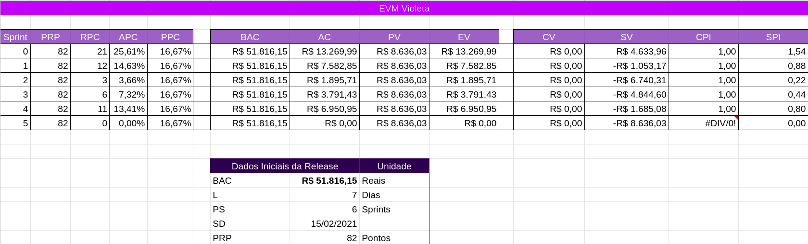

### Histórico de reivsão

| Data | Versão | Descrição | Autor(es)|
| -----|--------|-----------|-----------|
| 21/03/2021| 0.1 | Criação do Documento| Letícia Meneses|

----

 
 

# Introdução
AgileEVM é uma implementação adaptada do EVM que usa os artefatos do Scrum como entradas, usa cálculos EVM tradicionais e é expressa em métricas EVM tradicionais. AgileEVM requer um conjunto mínimo de parâmetros de entrada: o custo real de um projeto, um backlog estimado do produto, um plano de lançamento que fornece informações sobre o número de iterações no lançamento e a velocidade assumida.

 

# Orçamento

O orçamento total do projeto foi feito com base nos custos de:

 

- Um aluno para a Universidade de Brasília

 

- Aluguel de um computador para fins de desenvolvimento
 

- Internet

 

- Energia elétrica gasta nos computadores.

 

Para um melhor entendimento do orçamento total, a tabela abaixo apresenta os cálculos feitos para essa estimativa.

 
 

### Custo por aluno

| Custos Anuais | Custos Mensais | Durante o Projeto | Total para nove alunos|
| ------ |------| ------| ------|
| R$ 15.000,00 | R$ 1.250,00 | R$ 3.750,00 | R$ 33.750 |

 
 

### Custo do aluguel de computadores

Core i7

| Custo Mensal | Durante o Projeto | Total para os nove integrantes |
| -----| -----| -----|
| R$ 435,00 | R$ 1.305,00 | R$ 11.745,00|

 
 

### Custo de Internet

| Custo Médio Mensal | Durante o Projeto | Total para os nove integrantes |
| --- | --- | ---- | 
| R$ 114,15 | R$ 342,45 | R$ 3.082,05 |

 
 

### Custo Energia Elétrica

| Custo da energia para um desktop: 1h por dia em 30 dias | Custo por horas médias diárias do time | Durante o projeto | Total para os nove integrantes |
| ---- | ---- | ---- |----|
| R$ 29,55 | R$ 119,97 | R$ 359,9 | R$ 3.239,1 |

 
 

### Orçamento Total

| Valor total do projeto|
|----|
|R$ 51.816,15|

 

 

# Estimativa de Custos

A tabela abaixo conta todos os dados necessários para a elaboração do Agile EVM, considerando o número de sprints até a Release 1, número de dias por sprint, total de pontos estimados para a R1 e quantos deles foram realizados, e o orçamento toal do projeto levanto em consideração os custos levantados acima.

Abaixo segue a tabela de sigla necessárias para entender todos os cálculos e custos estimados no planilha.

 

- Tabela 1 - Definições e significados das siglas utilizadas na planilha

| Sigla | Definição |
| ----| ----|
| BAC | Orçamento total planejado para a Release |
| L | Duração da Sprint |
| PS | número total de sprints planejadas para a Release |
| SD | Data de inicio até chegar na Release |
| PRP | Pontos planejados para serem feitos na Release |
| RPC  | Pontos concluidos na Release |
| APC | Porcentagem real de conclusão da Release |
| PPC | porcentagem planejada de conclusão |
| AC | Custo Real | 

- Tabela 2 - Equações de custos necessárias para as estimativas

| Equação | Definição |
| ---- | ---- |
| PV =  PPC * BAC | Valor planejado |
| EV = APC * BAC | valor agregado |
| CV = EV - AC | variancia de custo |
| SV = EV - PV | variancia no cronograma |
| CPI = EV / AC | indice de performance de custo |
| SPI = EV / PV |  indice de performance do cronograma|

 
 

Documento completo abaixo.

<iframe weidth="200%" height="500" src="https://docs.google.com/spreadsheets/d/e/2PACX-1vQwAgC96ionjjLl9JorY3oZZ9QpzvFnSY70JgN7bdcVyYo7K-BWRwhoL-nkE7IFSm21dTafwCCKLCSa/pubhtml?widget=true&amp;headers=false"></iframe>