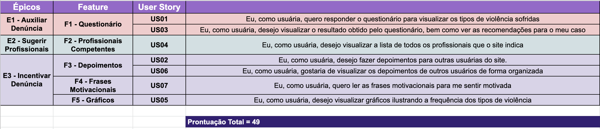

## Sprint backlog

### Histórico da Revisão
| Data | Versão | Descrição | Autor |
|---|---|---|---|
| 22/03/2021| 0.1 |Criação do documento | Ana Carolina Carvalho |

## Backlog do projeto

O backlog, também conhecido como backlog de produto ou “product backlog”, é uma lista de tarefas com breves descrições de todas as funcionalidades desejadas que devem entrar para um produto específico ainda não atribuídas a um responsável no projeto. Essa lista traz os requisitos para um produto, priorizados de acordo com o valor entregue e o impacto que isso tem no produto para o cliente.

Já o sprint backlog é uma lista de tarefas que o time se compromete a fazer em uma Sprint. Os itens do Sprint Backlog são extraídos do Product Backlog, descrito acima, pela equipe, baseando-se nas prioridades definidas pelo Product Owner e a percepção da equipe sobre o tempo que será necessário para completar as várias funcionalidades. Note que o período que eles são feitos é diferente. 
Cabe à equipe de desenvolvimento determinar a quantidade de itens do Product Backlog que serão trazidos para o Sprint Backlog, já que são eles quem irão se comprometer a implementá-los.

## Backlog do produto do projeto

Após as dinâmicas do Lean Inception, segue o resultados do backlog do produto, priorizado conforme as necessidades do usuário e impacto no valor do negócio. O mesmo já passou por um recente refinamento. Todas as USs estão como issue no GitHub. 

## Lista de Histórias de Usuário

[US01 - Responder questionário](https://github.com/fga-eps-mds/2020.2-Violeta-Desenvolvimento/issues/2)
[US02 - Cadastrar depoimento](https://github.com/fga-eps-mds/2020.2-Violeta-Desenvolvimento/issues/3)
[US03 - Resultado do questionário](https://github.com/fga-eps-mds/2020.2-Violeta-Desenvolvimento/issues/4)
[US04 - Profissionais competentes](https://github.com/fga-eps-mds/2020.2-Violeta-Desenvolvimento/issues/5)
[US05 - Visualizar dados](https://github.com/fga-eps-mds/2020.2-Violeta-Desenvolvimento/issues/6)
[US06 - Visualizar depoimentos](https://github.com/fga-eps-mds/2020.2-Violeta-Desenvolvimento/issues/7)
[US07 - Frases motivacionais](https://github.com/fga-eps-mds/2020.2-Violeta-Desenvolvimento/issues/8)

