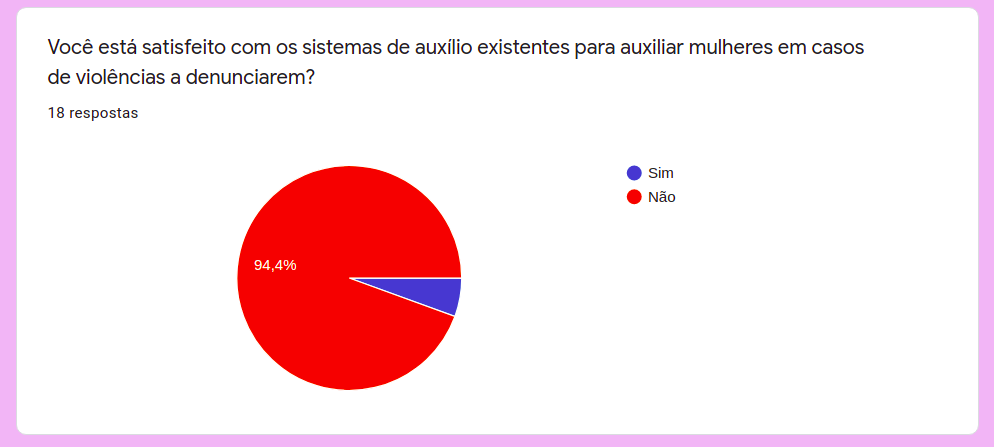
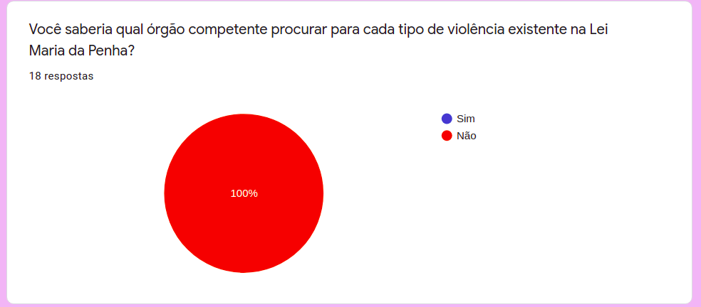
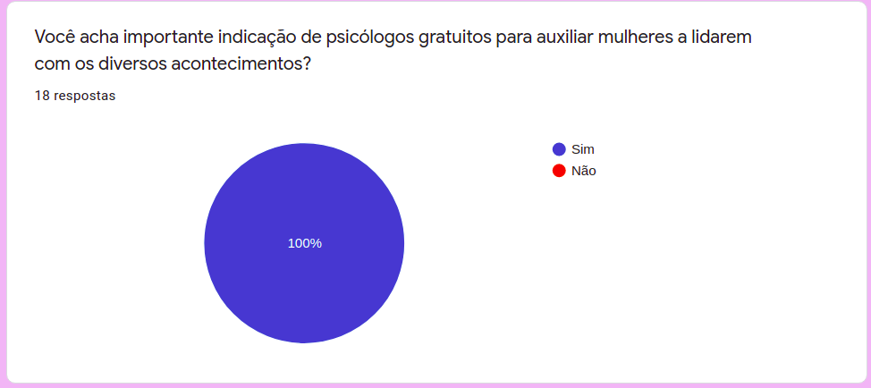

### Histórico de reivsão

| Data | Versão | Descrição | Autor(es)|
| -----|--------|-----------|-----------|
| 21/03/2021| 0.1 | Criação do Documento| Letícia Meneses|

----

 
 

# Introdução
Esse documento tem como finalidade abordar as questões que serão usadas na aplicação e repondidas pelas usuárias. Foi feito um levantamento de questões para cada tipo de violência com base na [LEI Nº 11.340, DE 7 DE AGOSTO DE 2006](http://www.planalto.gov.br/ccivil_03/_Ato2004-2006/2006/Lei/L11340.htm), a Lei Maria da Penha.

 
 

# Questionário
O questionário foi levantado pelos membros do time, com ênfase nas mulheres que o integram, por se tratar de um assunto de extrema importância e entenderem mais sobre o assunto em questão.
Para validar as questões e ter um certo cuidado com o que será abordado às usuáarias, foi feito um formulário para que a comunidade pudesse opinar nas questões levantas, e assim validando nosso produto.

## Formulário
O formulário foi feito pelo Google Forms e consta com perguntas a serem utilizadas n aplicação. Nele fizemos perguntas de pesquisa para saber se atendemos um grande número de mulheres na comunidade. Ele foi divulgado para grupos feminimos da universidade ou de times de estudos de programação. Nele abordamos os seguintes tópicos:

- Contexto inserido
- Opiniões e sugestões de melhores abordagens
- Uso de palavras e frases que possam gerar gatilhos
- Sugestões de melhoras na elaboração dessas perguntas
- Utilidade de profissionais psicológicos para ajudar nesses casos de violência
- Direcionamento de órgãos competentes

Como resposta para as principais funcionalidades, tivemos uma validação muito boa para nosso produto. A maioria das mulheres que responderam esse questionário não acham os atuais métodos de direcionamento muito eficazes e não saberiam quais órgão responsáveis procurar para cada tipo de violência ocorrida.

E todas as respostas validaram como útil a abordagem de profissionais psicológicos para tratarv e ajudar vítimas de violência a prosseguir mediante as circunstâncias inseridas.

 

## Questões

Com a validação feita pela comunidade, a elaboração do questionário prosseguiu e assim com ele a Árvore de Decisão que é o ponto chave para ao desenvolvimento. Assim, as ramificações de perguntas e resultados foram elaborados e segue perguntas discretas que não gere um tamanho desconforto ao responder, e todas perguntas tem como base a Lei Maria da Penha.
As perguntas e ramificações podem ser visualizadas no seguinte documento:

<iframe weidth="200%" height="600" src="https://docs.google.com/document/d/e/2PACX-1vTJEI9b466nc1P59eaFKjESz84tM772r1Al9S0w_H10_LFuO0X0LvihDAFEs5q1RrBhHUcDbdQ6--c2/pub?embedded=true"></iframe>

 
 
 
 

## Referências
- **LEI Nº 11.340, DE 7 DE AGOSTO DE 2006**. Disponível em: <http://www.planalto.gov.br/ccivil_03/_Ato2004-2006/2006/Lei/L11340.htm>. Acesso em: 2 de Março de 2021.
- **Instituto Maria da Penha**. Disponível em: <https://www.institutomariadapenha.org.br/>. Acesso em: 3 de Março de 2021.