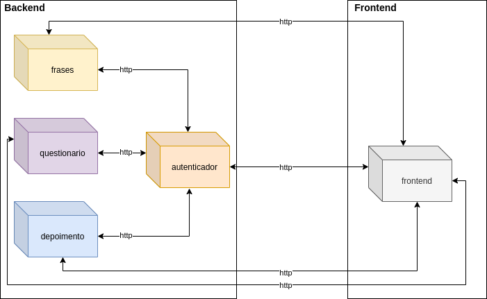
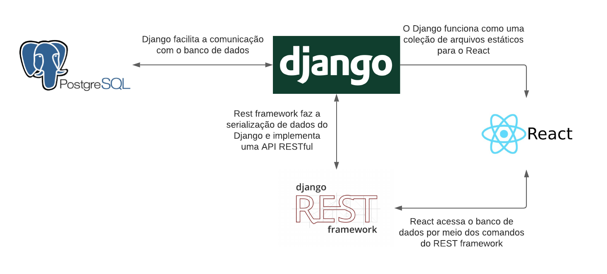

# Documento de Arquitetura de Software

## Histórico de Revisão
|Data|Versão|Descrição|Autor(es)|
|---|---|---|---|
|08/03/2021|0.1|Adicionado template do documento| Victor |
|18/03/2021|0.2|Adicionado Objetivo, Escopo e Representação Arquitetural|Philipe Serafim|
|18/03/2021|0.3|Adicionado conceitose siglas|Pedro Henrique|
|19/03/2021|0.4|Adicionadas informações no tópico API|Iago de Andrade|
|19/03/2021|0.5|Adicionado visão de implementação| Mateus M.|
|19/03/2021|0.6|Restrições e metas arquiteturais| Wesley Santos|
|20/03/2021|1.0|Adicionado Referências e links faltantes do sumário| Philipe Serafim|

## Sumário
[1. Introdução](#1.introducao)   

[1.1 Objetivo](#1.1.objetivo)   

[1.2 Escopo](#1.2.escopo)   

[1.3 Definições, Acrônimos e Abreviações](#1.3.definicao)   

[1.4 Referências](#1.4.referencias)   

[1.5 Visão Geral](#1.5.visaogeral)   

[2. Representação Arquitetural](#2.representacao)   

[2.1 API](#2.1.api)   

[2.1.1 Frontend](#2.1.1.frontend) 

[2.1.2 Questionário](#2.1.2.questionario) 

[2.1.3 Depoimentos](#2.1.3.depoimentos) 

[2.1.4 Frases](#2.1.4.frases) 

[2.1.5 Autenticador](#2.1.5.autenticador) 

[2.2 Framework ReactJs](#2.2.frameworkreact)   

[2.3 Framework Django](#2.3.frameworkdjango)   

[2.4 Banco de Dados](#2.4.bancodedados)   

[3. Restrições e Metas Arquiteturais](#3.restricoes)   

[3.1 Metas](#3.1.metas)

[3.2 Restrições](3.2.restricoes)

[4. Visão Lógica](#4.visaologica)   

[5. Visão de Implementação](#5.visaoimplementacao)   

## 1. Introdução 

## 1.1 Objetivo 
Este documento disponibiliza uma visão arquitetural do sistema, usando algumas visões de arquitetura para representar os diferentes aspectos do sistema. Ele pretende evidenciar decisões arquiteturais significativas tomadas em relação ao sistema.

## 1.2 Escopo 
Por meio deste documento, será possível entender o funcionamento do sistema do aplicativo web Violeta, bem como a metodologia do seu desenvolvimento. Desse modo, será possível ter uma compreensão da arquitetura do projeto.

## 1.3 Definições, Acrônimos e Abreviações 
- API: Application Programming Interface (Interface de Programação de Aplicativos)
- DRY: Don't Repeat Yourself
- FGA: Faculdade do Gama - Campus da Universidade de Brasília
- MVC: Model-View-Controller
- UnB: Universidade de Brasília
- WEB: World Wide Web

## 1.4 Referências  
- ReactJS: <a href="https://reactjs.org/tutorial/tutorial.html">Tutorial: Intro to React</a>. Acesso em: 18 de março de 2021.
- Django: <a href="https://www.django-rest-framework.org/">Django REST framework</a>. Acesso em: 19 de março de 2021.
- Django: <a href="https://docs.djangoproject.com/en/2.2/topics/db/models/">Models</a>. Acesso em: 19 de março de 2021.
- PostgreSQL: <a href="https://www.postgresql.org/docs/online-resources/">Tutorials & Other Resources</a>. Acesso em: 19 de março de 2021.
- JavaScript: <a href="https://developer.mozilla.org/pt-BR/docs/Web/JavaScript">JavaScript Tutoriais</a>. Acesso em: 19 de março de 2021.
- VALENTE, M. T. <a href="https://engsoftmoderna.info/cap7.html">Engenharia de Software Moderna</a>. Acesso em: 19 de março de 2021.

## 1.5 Visão Geral 
|**Tópico**|**Definição**|
|---|---|
|Introdução|Descreve informações sobre este documento.|
|Representação Arquitetural|Detalha a arquitetura de software utilizada para melhor compreensão de sua estrutura e funcionamento.|
|Metas e Restrições|Descreve os requisitos e objetivos do software e seus impactos na arquitetura.|
|Visão Lógica|Detalha componentes e escolhas relevantes ligadas à arquitetura do projeto.|
|Visão de Implementação|Permite a visualização e entendimento de como o sistema será implementado e com quais tecnologias, semelhante ao que a Representação Arquitetural faz. Porém, explana como cada tecnologia é composta.|

## 2 Representação Arquitetural 
A arquitetura do Violeta é composta por cinco microsserviços que são executados em contêineres individuais através do Docker. Os microsserviços são divididos em dois grupos,  backend e frontend, que comunicam-se através de rotas http.

Desse modo, os serviços são executados isolados evitando comportamentos inesperados, como por exemplo, serviços acessando recursos que não deveria. 

## 2.1 API 

Os microsserviços do backend utilizam Django com o REST framework para comunicação com o banco de dados PostgreSQL e com o frontend, o qual, por sua vez, funciona com o ReactJS. O diagrama acima resume a comunicação entre essas tecnologias.

### 2.1.1 Frontend 
Microsserviço que utiliza ReactJS para exibir as páginas web dos outros microsserviços do backend. É responsável por implementar a camada de visão do projeto.

### 2.1.2 Questionário 
Contém todos os dados pertinentes ao questionário e também faz a camada de controle com comandos para manipulação do banco de dados PostgreSQL implementado por meio do REST framework do Django.

### 2.1.3 Depoimentos 
Responsável por salvar e manipular os dados dos depoimentos no banco de dados PostgreSQL com a utilização do Django REST framework.

### 2.1.4 Frases 
Contém um banco de dados PostgreSQL com as frases motivacionais que aparecem ao longo da página do Violeta.
### 2.1.5 Autenticador 
Microsserviço de autenticação responsável por validar os usuários gerando token de acesso.

## 2.2 Framework ReactJs 
É um framework de código aberto voltado para a aplicação de criação de páginas web. A mesma se utiliza de HTML, CSS e JavaScript para ser aplicada. Por meio destes é possível desenvolver interfaces divididas em componentes reutilizáveis. No Violeta essa tecnologia é aplicada seguindo um layout de landing Page.

## 2.3 Framework Django 
O framework Django é um forma de aplicação web gratuita e de código aberto escrito em Python. Seguindo o princípio DRY (Don't Repeat Yourself). Permitindo assim otimizar ainda mais a fase de desenvolvimento.
No Violeta o Django é aplicado através do Django REST framework para viabilizar os microsserviços presentes no projeto por meio de API’s.

## 2.4 Banco de Dados 
O banco de dados do projeto é gerenciado pelo PostgreSQL. O PostgreSQL é um sistema de gerenciador de bancos de dados de código aberto com mais de 30 anos de constante desenvolviemento. O desenvolvimento ativo trouxe consigo história e confiança no mercado acarretando assim credibilidade. 

## 3. Restrições e Metas Arquiteturais 
 A partir da Lean-inception feita pela equipe, foi tomado o levantamento de restrições para o desenvolvimento do software e o usuário destino. Sendo assim, para melhor atender os requisitos definidos e utilizar das melhores tecnologias disponíveis, foram selecionadas as metas e restrições de arquitetura.
 
### 3.1 Metas 
 As metas arquiteturais definem como o sistema precisa responder às mudanças ao longo do tempo, direcionadas pelos requisitos de software. Por tanto, a usabilidade da aplicação estará presente para o cumprimento de seu objetivo, acessada pelos navegadores. A eficiência da WebApp irá conceder os dados e suas informações de forma clara e rápida ao usuário, para que assim possa gerenciar e acompanhar os processos de forma consistente.

### 3.2 Restrições 
 As restrições do projeto estão relacionadas às ferramentas e tecnologias escolhidas para o desenvolvimento do software.

- **Django:** Web Framework baseada em Python;

- **Django Rest Framework:** caixa de ferramentas e API's para o Django;

- **Python:** Linguagem utilizada no Django;

- **Java Script:** Linguagem utilizada, em conjunto com o HTML e CSS, para desenvolvimento WEB;

- **HTML:** Linguagem base utilizado em desenvolvimento WEB;

- **CSS:** Linguagem usada em conjunto HTML para estilizar a página;

- **Docker:** Plataforma open source que facilita a criação e administração de ambientes isolados;

- **PostgreSQL:** Sistema gerenciador de banco de dados objeto relacional;

- **ReactJS:** Biblioteca JavaScript declarativa, eficiente e flexível para a criação de interfaces de usuário

Além disso, existem restrições operacionais referentes à aplicação devido a vários fatores, tais como:

+   Topologia de rede
+   Ambiente WEB (configurações de servidor, firewall, dmzs, etc.)
+   Servidores (modelo de hardware, sistema operacional)

## 4. Visão Lógica  

### 4.1 Visão Geral 

O Violeta é uma aplicação WebApp composta da linguagem JavaScrip juntamente com o framework Reactjs como forma de implementação do front-end seguido do auxiolio de HTML e CSS para maior fidelidade do prototipo. Na que se refere ao back-end a linguagem python juntamente com framework Django voltado para modelagem de dados. Os dados seram armazenados é gerenciados pelo framework PostgreSQL. O PostgreSQL possibilida que depoimentos e as arvores de decisão seão salvas de forma pratica e eficiente.

## 5. Visão de Implementação 

### Django Rest Framework
Um projeto em Django é, geralmente, composto por diversas aplicações. Cada uma dessas aplicações é responsável por uma funcionalidade específica. Cada app é composto pelos seguintes diretórios e arquivos:

+ **models.py:** Este arquivo tem a função de implementar a camada model que, como explicado anteriormente, trabalha com a escrita e leitura de dados.

+ **urls.py:** Funciona como um endpoint. Ou seja, provém o acesso aos templates(análogo à views no modelo MVC).

+ **views.py:** Executa a camada view que recebe as requisições por meio dos métodos HTTP, trata-as e decide qual model será utilizada, e/ou template retornada ao usuário.

+ **serializers.py:** É um destaque desse framework. Com ele objetos são transformados em arquivos JSON, e assim é possível, por exemplo, preencher listas com dados, e também torna possível o contrário: receber dados por um arquivo no formato JSON e criar objetos a partir desses dados.

+ **tests.py:** Nele escrevemos todos os testes unitários que serão realizados na aplicação.

### React JS 
React Js é uma biblioteca JavaScript. Ele é baseado em componentes reutilizáveis, e seu modelo de pastas segue a seguinte orientação.

+ **public:** É onde ficam os arquivos globais que serão utilizados no aplicativo.

+ **components:** Nesta pasta estão todos o componentes do projeto, como React se orienta através de componentes estes componentes são públicos e podem ser utilizados em outras partes de aplicação.

+ **src:** Nesta pasta fica o código fonte do site, basicamente a estrutura principal do React.

+ **node_modules:** Pacotes utilizados no projeto, são utilizados por outros módulos.

+ **postgres-data:** Dados do Postgres, se refere ao banco de dados.
