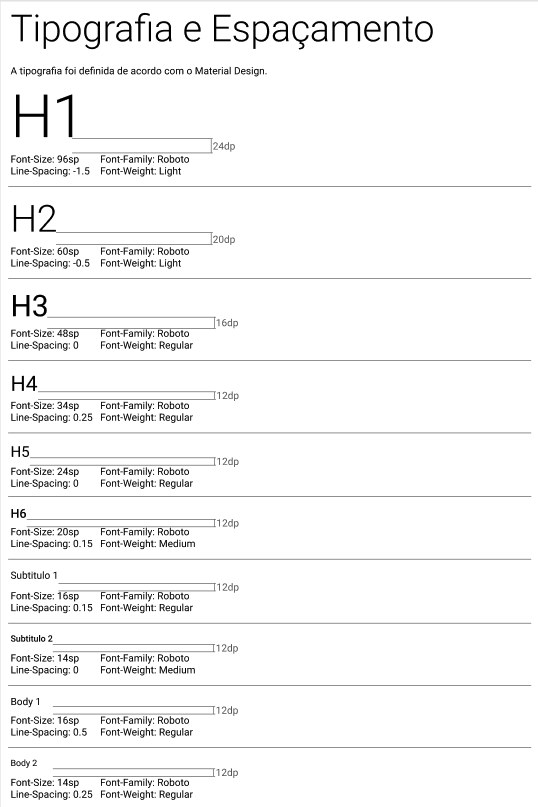
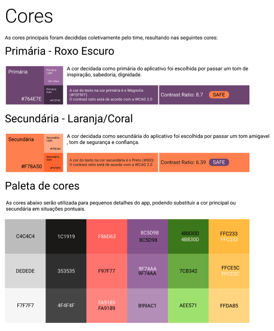
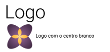
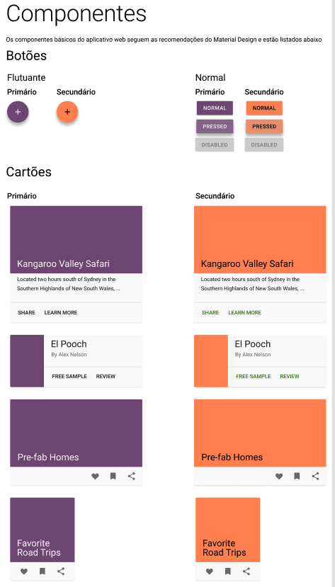
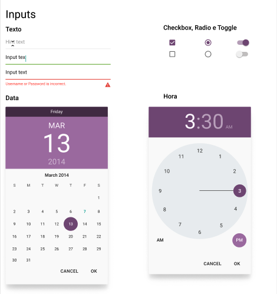
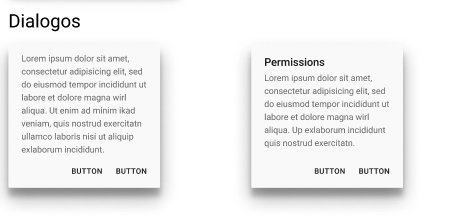
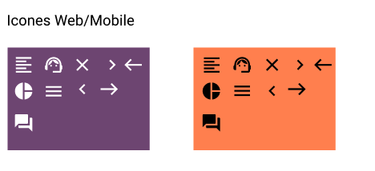

## Identidade visual

Identidade visual é o conjunto de elementos gráficos que tem como objetivo passar ao público uma ideia, valores, o propósito e a missão de um produto ou serviço. Alguns exemplos de elementos da identidade visual são: nome, slogan, cores, tipografia e outras peças de divulgação. Muito usados no marketing. 

### Histórico da Revisão
| Data | Versão | Descrição | Autor |
|---|---|---|---|
| 07/03/2021| 0.1 |Criação da identidade visual | Fabiana L. V. P. Ribas, Letícia Meneses, Philipe Serafim, Pedro Henrique, Iago de Andrade, Mateus M., Wesley Santos |
| 22/03/2021| 0.1 |Criação do documento | Ana Carolina Carvalho |

## Identidade visual do projeto

A identidade visual de um produto é uma construção de vários elementos gráficos e visuais responsáveis por influenciar a imagem a respeito de quem é o projeto, quais são seus valores, objetivos  e até mesmo como ela vê o mundo, a sociedade e o contexto que a mesma está inserida.

Para que qualquer marca seja igualmente reconhecida de forma positiva e, por consequência, tenha sucesso em seu nicho de atuação, é necessário determina-la e destacar suas melhores qualidades e diferenciais a fim de deixá-la única e muito mais interessante.
Dessa forma, a marca será reconhecida nos momentos de tomadas de decisão como um todo.

O conjunto de características que forma a identidade visual vai além de ser apenas um cartão de visita para atrair possíveis usuários de uma forma esteticamente superficial. Pense nela como basicamente a “personalidade” de um projeto sintetizado e exposta ao seu nicho e mundo.

### Tipografia e espaçamento

### Cores 

### Logo

### Componentes 

### Inputs

### Diálogos

### Ícones Web/Mobile

