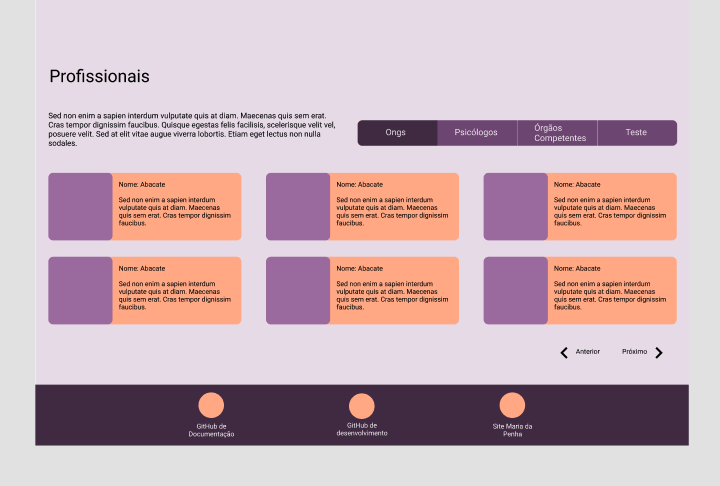
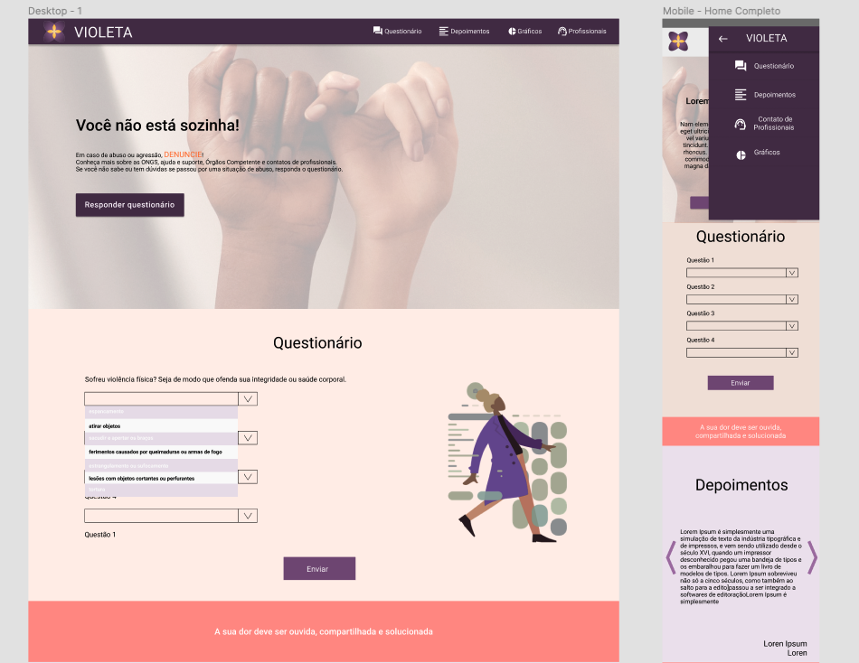
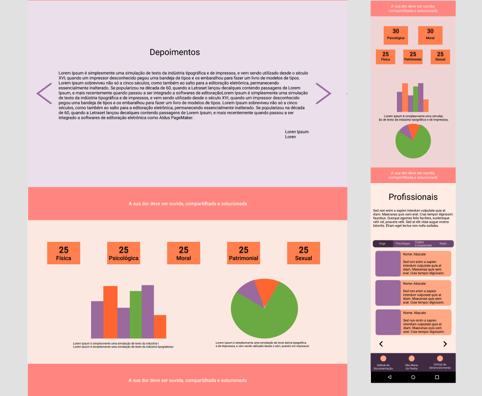

## Protótipos

A prototipação de um software é a atividade de criação de protótipos de aplicativos de software sendo ele dividido em alguns níveis de detalhamento, ou seja, versões incompletas do programa de software que está sendo desenvolvido. Os níveis são: baixa, média e alta fidelidade. Sendo estes níveis diretamente relacionados ao detalhamento. 

### Histórico da Revisão
| Data | Versão | Descrição | Autor |
|---|---|---|---|
| 07/03/2021| 0.1 |Criação do protótipo de baixa fidelidade | Fabiana L. V. P. Ribas, Letícia Meneses, Philipe Serafim, Pedro Henrique, Iago de Andrade, Mateus M., Wesley Santos |
| 22/03/2021| 0.1 |Criação do documento | Ana Carolina Carvalho |

## Protótipo de alta fidelidade

Se trata de um protótipo com as funcionalidades e estética muito próximos do modelo final.
Os protótipos de alta fidelidade abrangem não apenas a interface da pessoa usuária (UI) do produto em termos visuais e estéticos, mas também os aspectos da experiência do(a) usuário(a) (UX) em termos de interações, fluxo e comportamento.

## Protótipo produzido pelo time 

Nossa UX/UI se reuniu com o time de MDS para explicar o que são os protótipos, quais níveis existem e os auxiliar na construção do nosso. Após todos terem em mente quais as funcionalidades que estão contidas no projeto, os membros tiveram insumos para pensar na organização das telas.

Nesta terceira fase o esboço precisa ser muito mais detalhado e deve levar a usabilidade em consideração, não apenas nos fluxos da informação e funções do app, além de se parecer o mais próximo possível do que será de fato implementado.  
Visando o alto detalhamento dos ícones e cores, o time se preocupou em pensar nas telas responsivas neste terceiro esboço também, até porque será este o principal guia para o time de desenvolvimento tomar como referência na criação do front-end, trazendo toda a nossa personalidade, identidade visual e alinhando isso ao propósito final do produto. 

Segue imagem do protótipo e link para acessá-lo com maior qualidade. 

## Ferramenta

A ferramenta usada foi o Figma. Figma é um editor gráfico de vetor e prototipagem de projetos de design baseado principalmente no navegador web.
A ferramenta escolhida nos deu todo o apoio que precisávamos neste momento do projeto. Onde contamos com mais recursos visuais. 

[Protótipo de alta fidelidade](https://www.figma.com/file/GvNiDz8VEmTypTAkxlIHrB/Alta-fidelidade-Violeta?node-id=0%3A1)