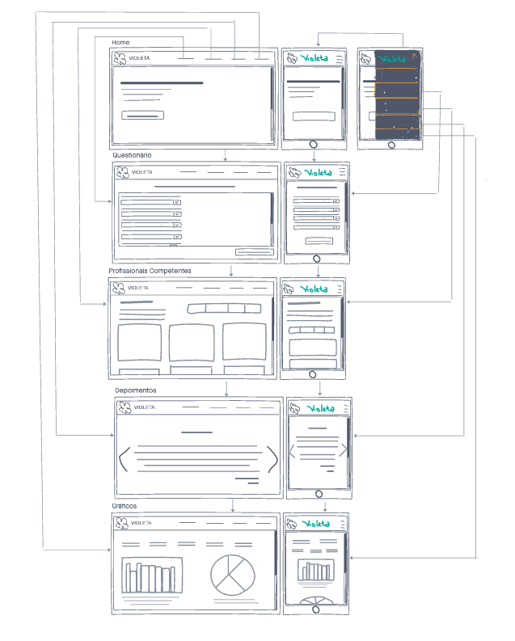

## Protótipos

A prototipação de um software é a atividade de criação de protótipos de aplicativos de software sendo ele dividido em alguns níveis de detalhamento, ou seja, versões incompletas do programa de software que está sendo desenvolvido. Os níveis são: baixa, média e alta fidelidade. Sendo estes níveis diretamente relacionados ao detalhamento. 

### Histórico da Revisão
| Data | Versão | Descrição | Autor |
|---|---|---|---|
| 05/03/2021| 0.1 |Criação do protótipo de baixa fidelidade | Fabiana L. V. P. Ribas, Letícia Meneses, Philipe Serafim, Pedro Henrique, Iago de Andrade, Mateus M., Wesley Santos |
| 22/03/2021| 0.1 |Criação do documento | Ana Carolina Carvalho |

## Protótipo de baixa fidelidade

Um protótipo de baixa fidelidade simula algumas características do projeto, sendo que a ênfase é na funcionalidade e não na estética. Nesse tipo de modelo, geralmente, pretende-se obter um feedback de usuários que farão o teste preliminar.

Características dos protótipos de baixa fidelidade:

- Possui baixo grau de detalhamento;
- Apresenta visualmente a funcionalidade;
- Não possui recursos de interação;
- Não exibe necessariamente o mesmo design da versão final;
- Podem ser realizados no papel.

## Protótipo produzido pelo time 

Nossa UX/UI se reuniu com o time de MDS para explicar o que são os protótipos, quais níveis existem e os auxiliar na construção do nosso. Após todos terem em mente quais as funcionalidades que estão contidas no projeto, os membros tiveram insumos para pensar na organização das telas.

Neste primeiro momento o esboço é bem simples e não leva a usabilidade em consideração, apenas nos fluxos da informação e funções do app. 
Apesar do baixo detalhamento, o time se preocupou em pensar nas telas responsivas já neste primeiro esboço. 

Segue imagem do protótipo e link para acessá-lo com maior qualidade. 

## Ferramenta

A ferramenta usada foi o InVision. Plataforma para criação de design de produtos digitais, pensando na experiência do usuário. 
Não usamos o figma nessa fase do projeto por se tratar de uma interface de baixo detalhamento, além da boa apresentação que o InVision oferece.

[Protótipo de baixa fidelidade](https://prototipodebaixafidelidadevioleta.invisionapp.com/freehand/violeta-eXaGk6o7V)