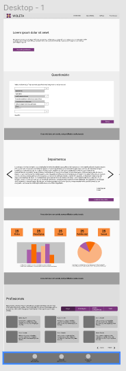

## Protótipos

A prototipação de um software é a atividade de criação de protótipos de aplicativos de software sendo ele dividido em alguns níveis de detalhamento, ou seja, versões incompletas do programa de software que está sendo desenvolvido. Os níveis são: baixa, média e alta fidelidade. Sendo estes níveis diretamente relacionados ao detalhamento. 

### Histórico da Revisão
| Data | Versão | Descrição | Autor |
|---|---|---|---|
| 06/03/2021| 0.1 |Criação do protótipo de média fidelidade | Fabiana L. V. P. Ribas, Letícia Meneses, Philipe Serafim, Pedro Henrique, Iago de Andrade, Mateus M., Wesley Santos |
| 22/03/2021| 0.1 |Criação do documento | Ana Carolina Carvalho |
| 23/03/2021| 0.2 |Atualização das imagens do prototipo | Fabiana L. V. P. Ribas |

## Protótipo de média fidelidade

Esse tipo de protótipo é usado, geralmente, quando queremos testar o protótipo e a hierarquia da informação é algo importantíssimo no projeto. Um exemplo disso é se estamos desenvolvendo um questionário e queremos testar com o usuário se o fluxo das perguntas está bem estruturado. Esse tipo de teste envolve não somente o modelo mental do usuário (como é a ênfase do protótipo de baixa fidelidade), é necessário entender se o alinhamento, disposição dos botões, contraste e tamanho das informações estão confortáveis. Nesta fase levamos em consideração a experiência do usuário na jornada de utilização do produto. A usabilidade é observada com muito cuidado. 

## Protótipo produzido pelo time 

Nossa UX/UI se reuniu com o time de MDS para explicar o que são os protótipos, quais níveis existem e os auxiliar na construção do nosso. Após todos terem em mente quais as funcionalidades que estão contidas no projeto, os membros tiveram insumos para pensar na organização das telas.

Nesta segunda fase o esboço precisa ser mais detalhado e deve levar a usabilidade em consideração, não apenas nos fluxos da informação e funções do app, mas também se atentar a disposição dos ícones. 
Apesar do médio detalhamento, o time se preocupou em pensar nas telas responsivas neste segundo esboço e também em começar a incrementar um pouco da nossa identidade, trazendo a personalidade e alinhando isso ao propósito do produto. 

Segue imagem do protótipo e link para acessá-lo com maior qualidade. 

## Ferramenta

A ferramenta usada foi o Figma. Figma é um editor gráfico de vetor e prototipagem de projetos de design baseado principalmente no navegador web.
A ferramenta escolhida nos deu todo o apoio que precisávamos neste momento do projeto. Onde contamos com mais recursos visuais. 

[Protótipo de média fidelidade](https://www.figma.com/file/WJ3DSlJ6ZmjJbGAx5zuWOx/M%C3%A9dia-fidelidade-Violeta?node-id=0%3A1)